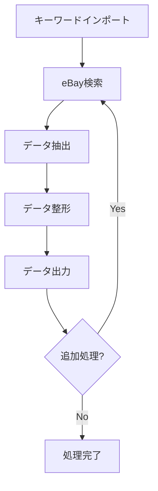

# eBay データ収集・分析ツール 包括的設計書

## 目次

1. システム概要
2. データベース設計
3. インターフェース仕様
4. クラス・モジュール設計
5. システムアーキテクチャ
6. 機能設計
7. 非機能要件
8. テスト計画
9. リスク管理
10. 開発スケジュール

## 1. システム概要

### 1.1 システムの目的と背景

### 目的の詳細展開

本システムは、EC販売事業者が迅速かつ効率的に市場調査を行うためのデータ収集・分析ツールである。具体的には以下の戦略的目標を実現する：

1. **市場インテリジェンスの獲得**
    - リアルタイムの価格トレンド分析
    - 競合他社の出品戦略の把握
    - 需要と供給のダイナミクスの理解
2. **データ駆動型意思決定支援**
    - 客観的な市場データに基づく価格設定
    - 在庫管理の最適化
    - 販売戦略の継続的な改善

### 想定ユーザープロファイル

- 小規模〜中規模のEC販売事業者
- クロスボーダーEC事業者
- 多品種少量販売モデルの事業者
- データ分析に積極的なオンラインセラー

### 1.2 システム全体の動作フロー



## 2. データベース設計 (SQLAlchemy版)

### 2.1 データモデル定義

```python
from sqlalchemy import Column, Integer, String, Float, DateTime, Text, ForeignKey
from sqlalchemy.ext.declarative import declarative_base
from sqlalchemy.orm import relationship
from datetime import datetime

Base = declarative_base()

class Keyword(Base):
    __tablename__ = 'keywords'

    id = Column(Integer, primary_key=True)
    keyword = Column(String, nullable=False)
    category = Column(String)
    last_searched_at = Column(DateTime)
    created_at = Column(DateTime, default=datetime.utcnow)
    status = Column(String, default='active')

    # リレーションシップ
    search_results = relationship("EbaySearchResult", back_populates="keyword")

class EbaySearchResult(Base):
    __tablename__ = 'ebay_search_results'

    id = Column(Integer, primary_key=True)
    keyword_id = Column(Integer, ForeignKey('keywords.id'))
    item_id = Column(String, nullable=False)
    title = Column(String)
    price = Column(Float)
    shipping_price = Column(Float)
    stock_quantity = Column(Integer)
    seller_name = Column(String)
    seller_rating = Column(Float)
    auction_end_time = Column(DateTime)
    listing_type = Column(String)
    search_timestamp = Column(DateTime, default=datetime.utcnow)

    # リレーションシップ
    keyword = relationship("Keyword", back_populates="search_results")

class SearchHistory(Base):
    __tablename__ = 'search_history'

    id = Column(Integer, primary_key=True)
    start_time = Column(DateTime, default=datetime.utcnow)
    end_time = Column(DateTime)
    total_keywords = Column(Integer)
    processed_keywords = Column(Integer)
    status = Column(String)
    error_log = Column(Text)

```

### 2.2 データベース管理クラス

```python
from sqlalchemy import create_engine
from sqlalchemy.orm import sessionmaker, scoped_session

class DatabaseManager:
    def __init__(self, db_path='sqlite:///ebay_research.db'):
        """
        データベース接続の初期化

        Args:
            db_path (str): データベース接続文字列
        """
        self.engine = create_engine(db_path, echo=True)
        self.SessionLocal = scoped_session(sessionmaker(bind=self.engine))

    def create_tables(self):
        """すべてのテーブルを作成"""
        Base.metadata.create_all(self.engine)

    def get_session(self):
        """セッションを取得"""
        return self.SessionLocal()

    def add_keyword(self, keyword, category=None):
        """
        キーワードを追加

        Args:
            keyword (str): 検索キーワード
            category (str, optional): キーワードカテゴリ

        Returns:
            Keyword: 追加されたキーワードオブジェクト
        """
        session = self.get_session()
        try:
            new_keyword = Keyword(
                keyword=keyword,
                category=category,
                status='active'
            )
            session.add(new_keyword)
            session.commit()
            return new_keyword
        except Exception as e:
            session.rollback()
            raise e
        finally:
            session.close()

    def save_search_results(self, keyword_id, results):
        """
        検索結果を保存

        Args:
            keyword_id (int): キーワードID
            results (list): 検索結果のリスト
        """
        session = self.get_session()
        try:
            search_results = [
                EbaySearchResult(
                    keyword_id=keyword_id,
                    item_id=result.get('item_id'),
                    title=result.get('title'),
                    price=result.get('price'),
                    # 他のフィールドも同様に設定
                ) for result in results
            ]

            session.add_all(search_results)
            session.commit()
        except Exception as e:
            session.rollback()
            raise e
        finally:
            session.close()

    def start_search_history(self, total_keywords):
        """
        検索履歴の開始を記録

        Args:
            total_keywords (int): 総キーワード数

        Returns:
            int: 検索履歴ID
        """
        session = self.get_session()
        try:
            history = SearchHistory(
                total_keywords=total_keywords,
                processed_keywords=0,
                status='in_progress'
            )
            session.add(history)
            session.commit()
            return history.id
        except Exception as e:
            session.rollback()
            raise e
        finally:
            session.close()

```

### 2.3 データベース操作のベストプラクティス

1. セッション管理
    - `scoped_session`を使用
    - コンテキストマネージャーでセッションを管理
    - エラー時にロールバック
2. トランザクション処理
    - 明示的なコミット/ロールバック
    - エラーハンドリング
3. モデル間のリレーションシップ
    - SQLAlchemyのORMを活用
    - 外部キー制約の自動管理

## 追加設定

### 依存関係

```
sqlalchemy==1.4.x

```

### 環境設定例

```python
# config.yaml
database:
  type: sqlite
  path: ./ebay_research.db
  echo: true  # デバッグ用SQL出力

```

## 3. インターフェース仕様

### 3.1 コマンドラインインターフェース (CLI)

### CLI実装の主要メソッド

```python
class EbayResearchCLI:
    def run(self):
        """メインコマンドラインインターフェース"""
        parser = argparse.ArgumentParser(description='eBay市場調査ツール')

        # コマンドの定義
        parser.add_argument('--import', help='キーワードをインポート', action='store_true')
        parser.add_argument('--search', help='キーワードで検索を実行', action='store_true')
        parser.add_argument('--export', help='結果をエクスポート', action='store_true')
        parser.add_argument('--config', help='設定ファイルのパス', type=str)

        args = parser.parse_args()
        self._process_args(args)

```

### 3.2 Google Sheets API インターフェース

```python
class GoogleSheetsInterface:
    def read_keywords(self, spreadsheet_id, range_name):
        """スプレッドシートからキーワードを読み取る"""
        sheet = self.service.spreadsheets()
        result = sheet.values().get(
            spreadsheetId=spreadsheet_id,
            range=range_name
        ).execute()
        return result.get('values', [])

```

## 4. クラス・モジュール設計

### 4.1 メインアプリケーションクラス

```python
class EbayResearchTool:
    def __init__(self, config_path):
        """アプリケーションの初期化"""
        self.config = ConfigManager(config_path)
        self.database = DatabaseManager(self.config.get_db_path())
        self.keyword_manager = KeywordManager(self.database)
        self.scraper = EbayScraper(self.config)
        self.exporter = DataExporter()
        self.logger = LoggerManager()

    def run_research_workflow(self, keywords=None):
        """メイン研究ワークフロー"""
        try:
            # キーワードの取得
            keywords = keywords or self.keyword_manager.get_active_keywords()

            # 検索履歴の開始
            search_history_id = self.database.start_search_history()

            # 並列検索の実行
            results = self.parallel_search(keywords)

            # 結果の保存
            self.database.save_search_results(results)

            # 検索履歴の更新
            self.database.update_search_history(
                search_history_id,
                status='completed'
            )

            # エクスポート
            self.exporter.export_to_csv(results)
            self.exporter.export_to_sheets(results)

        except Exception as e:
            self.logger.error(f"Research workflow failed: {e}")

```

### 4.2 モジュール階層

```
ebay_research_tool/
│
├── core/
│   ├── config_manager.py
│   ├── database_manager.py
│   └── logger_manager.py
│
├── services/
│   ├── ebay_scraper.py
│   ├── keyword_manager.py
│   └── data_exporter.py
│
├── interfaces/
│   ├── cli_interface.py
│   └── sheets_interface.py
│
└── main.py

```

## 5. システムアーキテクチャ

### 5.1 アーキテクチャ設計の基本方針

- レイヤードアーキテクチャ
- モジュラーデザイン
- 疎結合
- 拡張性の確保

### 5.2 主要レイヤー

1. プレゼンテーション層（CLI、インターフェース）
2. ビジネスロジック層（データ処理、検索ロジック）
3. データアクセス層（データベース、外部API連携）

## 6. 機能設計

### 6.1 キーワードインポート機能

```python
def validate_keywords(keywords):
    """キーワードのバリデーション"""
    validated_keywords = []
    for keyword in keywords:
        # 長さチェック
        if 2 <= len(keyword) <= 100:
            # 特殊文字除去
            cleaned_keyword = re.sub(r'[^\w\s]', '', keyword)
            validated_keywords.append(cleaned_keyword)
    return validated_keywords

```

### 6.2 eBayスクレイピング戦略

```python
def extract_ebay_data(page, keyword):
    """eBayデータ抽出"""
    results = []
    items = page.query_selector_all('.s-item')

    for item in items:
        result = {
            'keyword': keyword,
            'price': extract_price(item),
            'stock': extract_stock(item),
            'seller_rating': extract_seller_rating(item)
        }
        results.append(result)

    return results

```

## 7. 非機能要件

### 7.1 パフォーマンス

- 1,000キーワードを60分以内に処理
- 並列処理による効率化
- リクエスト間隔の動的制御

### 7.2 セキュリティ

1. **認証情報管理戦略**
    - 認証情報の多層的セキュリティ保護
    - 環境変数による機密情報管理
    - 暗号化キーの安全な保存
    - 認証情報のローテーション機能
2. **認証情報保護メカニズム**
    - `.env`ファイルを使用した環境変数管理
    - 認証情報の暗号化（`cryptography`ライブラリ利用）
    - 認証情報アクセスの厳密なロール制御

### 7.3 環境設定ガイドライン

### 7.3.1 依存関係管理

```
# requirements.txt
sqlalchemy==1.4.46
playwright==1.32.0
pandas==2.0.1
python-dotenv==1.0.0
cryptography==40.0.2
google-auth==2.18.1
google-auth-oauthlib==1.0.0
google-auth-httplib2==0.1.0
google-api-python-client==2.86.0

```

### 7.3.2 仮想環境セットアップ

```bash
# Pythonバージョン3.9以上を推奨
python3 -m venv ebay_research_env
source ebay_research_env/bin/activate  # Unix系
# または
ebay_research_env\Scripts\activate  # Windows

# 依存関係のインストール
pip install -r requirements.txt

```

### 7.3.3 環境変数設定

```bash
# .env ファイル
	EBAY_USERNAME=your_username
	EBAY_PASSWORD=your_encrypted_password
	GOOGLE_SHEETS_CREDENTIALS_PATH=/path/to/credentials.json
	ENCRYPTION_KEY=your_secure_encryption_key

```

### 7.4 コンプライアンスと法的対応

1. eBay利用規約の定期的レビュー
2. スクレイピング範囲の厳密な制限
3. 法務部門との継続的な連携
4. 自動法的リスク評価メカニズムの検討

## 8. テスト計画

### 8.1 テストカバレッジ目標

- データインポート: 80%以上
- スクレイピングロジック: 85%以上
- データ整形・出力機能: 90%以上

### 8.2 テスト種類

- ユニットテスト
- 統合テスト
- エラーハンドリングテスト

## 9. リスク管理

### 9.1 法的リスク対応

- eBay利用規約の定期的確認
- スクレイピング範囲の適切な制限

### 9.2 技術的リスク

- サイト構造変更への対応
- CAPTCHA対策
- プロキシ・IP管理戦略

## 10. 開発スケジュール

### 10.1 マイルストーン

1. 要件確定: 2週間
2. 基本設計: 1週間
3. プロトタイプ開発: 4週間
4. テスト: 2週間
5. 最終調整: 1週間

### 10.2 リリーススケジュール

- α版: 開発開始後8週間
- β版: 開発開始後12週間
- 正式リリース: 開発開始後16週間

---

**注意事項**

- 本設計書は初期バージョンであり、継続的な改善が前提
- 実装時に詳細な仕様調整が必要
- ユーザーフィードバックを反映し、柔軟に対応する